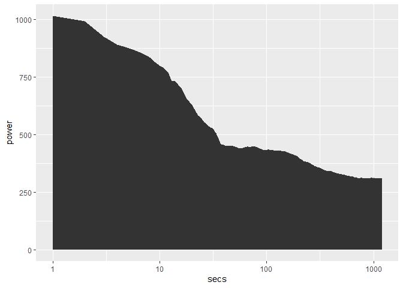

<!-- --><!-- --><!-- --><!-- -->

    ## Warning: Removed 29 rows containing missing values (`geom_path()`).

<!-- -->

    ## [1] "01:04:33"
    ## [1] 96.92903
    ## [1] 741.4
    ## [1] 275.2829
    ## [1] 296
    ## [1] 346.9586
    ## [1] 308.9733
    ## [1] 356.5567
    ## [1] 440.2667
    ## [1] 714.8667
    ## [1] 1066.171
    ## [1] 96.41694
    ##    heart_zone    V1
    ## 1:          1 03:09
    ## 2:          2 22:54
    ## 3:          3 36:57
    ## 4:          4 01:34
    ##    power_zone    V1
    ## 1:          1 09:30
    ## 2:          2 05:30
    ## 3:          3 08:10
    ## 4:          4 22:37
    ## 5:          5 11:53
    ## 6:          6 04:47
    ## 7:          7 02:07
